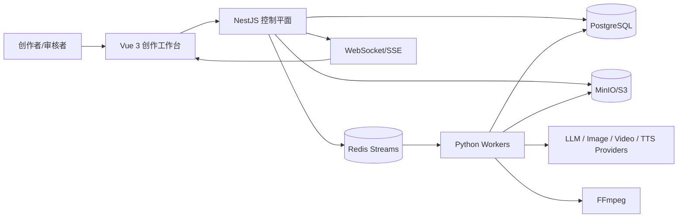

# AI漫剧平台架构说明书 v1.1

> **状态**：架构草案，待项目负责人评审批准
> **日期**：2026-09-19
> **适用版本**：V1 可闭环 MVP
> **关联实施计划**：`AI漫剧创作平台实施计划.md`

## 1. 架构目标

V1 的目标不是一次性覆盖所有 AI 模型和专业剪辑能力，而是实现一集短篇内容的可追溯闭环：

```text
SourceDocument
→ ScriptVersion
→ Scene / Beat / ShotVersion
→ AssetVersion
→ GenerationCandidate
→ TimelineVersion
→ RenderJob
→ QC / Review
→ Export
```

系统必须满足：

1. PostgreSQL 是业务数据和状态的唯一事实源。
2. Redis Streams 只负责任务派发、锁、缓存和实时事件。
3. 所有下游内容引用具体版本，不直接引用会变化的逻辑对象。
4. 所有 AI 结果保存模型、参数、Prompt、参考文件、状态和成本。
5. 自动节点与人工审核节点组成可恢复工作流。
6. MP4 是渲染结果，Timeline JSON/EDL 才是成片工程事实源。

## 2. 系统上下文



## 3. V1 部署拓扑

```text
Docker Compose
├── web                 Vue 3 静态资源 / Nginx
├── api                 NestJS 模块化单体
├── postgres            PostgreSQL + 可选 pgvector
├── redis               Redis Streams / Cache / Lock
├── minio               S3 兼容对象存储
├── llm-worker          内容理解、剧本、分镜、Prompt
├── media-worker        图片、视频、音频生成适配
├── render-worker       代理、转码、FFmpeg 合成
├── qc-worker           画面、音频、剧情质检
└── nginx               入口代理（按部署环境选择）
```

V1 不引入 Kafka、Kubernetes、独立微服务体系或独立向量数据库。Worker 可以共享代码库，通过启动参数或队列名称区分能力。

## 4. 领域边界

| 领域   | 事实对象                                                     | 说明                         |
| ------ | ------------------------------------------------------------ | ---------------------------- |
| IP     | Project、Season、Episode                                     | 内容组织和生产范围           |
| 原文   | SourceDocument、SourceDocumentVersion、SourceSegment         | 不可变来源与位置引用         |
| 剧本   | Script、ScriptVersion、Scene、Beat、Dialogue                 | 可审核的叙事工程             |
| 分镜   | Shot、ShotVersion、ShotDependency、StoryboardPanel           | 可生成的视频镜头设计         |
| 资产   | Asset、AssetVersion、AssetReference                          | 角色、场景、道具、声音、媒体 |
| 生成   | Generation、GenerationCandidate、ProviderJob                 | Provider 请求与候选结果      |
| 工作流 | Workflow、WorkflowRun、Task、TaskAttempt                     | 可重试、可取消、可恢复的任务 |
| 剪辑   | Timeline、TimelineVersion、Track、Clip、Transition、Keyframe | 非线性剪辑工程               |
| 审核   | Review、ReviewComment、Approval                              | 版本和时间码级人工闸门       |
| 渲染   | RenderJob、RenderSegment、ExportPreset                       | 增量渲染与导出               |
| 运营   | UsageRecord、CostRecord、AuditLog                            | 费用、用量、操作追踪         |

## 5. 版本与不可变性

### 5.1 版本规则

- 初始内容创建 `version = 1`。
- 已被下游任务或时间线引用的版本不可原地修改。
- 修改内容必须复制生成新版本，并记录 `parentVersionId`、变更摘要和创建者。
- 审核状态绑定具体版本；新版本默认回到草稿或待审核状态。
- 任务载荷必须带 `inputVersion`，任务完成时检查当前版本是否仍匹配。
- 过期结果可以保存，但不能自动提升为当前有效结果。

### 5.2 对象存储路径

```text
projects/{projectId}/
  source/{sourceDocumentId}/{sourceVersionId}/original.ext
  assets/{assetId}/{assetVersionId}/reference-{index}.png
  generations/{generationId}/{candidateId}/output.{ext}
  episodes/{episodeId}/timeline/{timelineVersionId}/timeline.json
  episodes/{episodeId}/render/{renderJobId}/segment-{index}.mp4
  episodes/{episodeId}/export/{renderJobId}/final.mp4
```

数据库保存元数据、哈希、MIME、尺寸、时长、对象路径和权限；大文件不直接写入 PostgreSQL。

## 6. API 边界

### 6.1 模块

```text
/api/v1/auth
/api/v1/projects
/api/v1/seasons
/api/v1/episodes
/api/v1/sources
/api/v1/scripts
/api/v1/storyboards
/api/v1/assets
/api/v1/generations
/api/v1/tasks
/api/v1/timelines
/api/v1/reviews
/api/v1/renders
/api/v1/costs
```

### 6.2 API 约定

- 所有写入接口返回资源 ID、版本号、状态和 `traceId`。
- 长任务接口只创建 Task，不同步等待 AI 或 FFmpeg 完成。
- 查询接口支持 `projectId`、状态、版本、分页和排序。
- 变更接口使用幂等键，避免用户重复点击产生重复任务。
- 权限检查必须同时验证用户、团队、项目和资源归属。
- 错误响应统一包含 `code`、`message`、`traceId` 和可选 `details`。

## 7. 事件与任务协议

### 7.1 Task 状态

```text
PENDING → QUEUED → RUNNING → SUCCEEDED
                         ├→ RETRYING → QUEUED
                         └→ FAILED
PENDING / QUEUED → CANCELLED
```

### 7.2 Task 最小载荷

```json
{
  "taskId": "task_xxx",
  "type": "VIDEO_GENERATE",
  "projectId": "project_xxx",
  "resourceType": "SHOT_VERSION",
  "resourceId": "shot_version_xxx",
  "inputVersion": 3,
  "idempotencyKey": "sha256...",
  "priority": 50,
  "attempt": 1,
  "maxAttempts": 3,
  "traceId": "trace_xxx"
}
```

### 7.3 Stream 约定

```text
stream:task:llm
stream:task:image
stream:task:video
stream:task:audio
stream:task:render
stream:task:qc
```

PostgreSQL 先写 Task 事实记录，再派发 Stream 消息。Worker 认领后写入 `TaskAttempt`，心跳超时由恢复程序重新入队；重复消费由 `idempotencyKey` 和数据库唯一约束兜底。

## 8. Provider Gateway 与 Prompt Compiler

统一能力接口：

```text
LLM.generateStructured()
Image.generate()
Video.generate()
TTS.synthesize()
Audio.process()
Render.render()
QC.inspect()
```

Provider Adapter 不直接修改业务对象，只返回标准化结果。Prompt Compiler 的输入为：

```text
项目视觉规则
+ 角色 AppearanceVersion
+ 场景 LocationVersion
+ 道具 AssetVersion
+ ShotVersion
+ 前后镜头连续性
+ 模型模板
+ 负面提示词
```

编译结果必须保存模板版本、标准化输入和 ProviderPrompt，确保任务可复现。V1 先实现 Mock Provider，再接入一个 LLM、一个 Image 和一个 Video Provider。

## 9. 工作流闸门

```text
原文导入
→ 内容理解审核
→ 剧本审核
→ 分镜审核
→ 资产审核/锁定
→ 镜头生成
→ 音频与粗剪
→ 自动质检
→ 时间线审核
→ 导出审核
```

任何自动修复都生成新版本；系统不能未经允许覆盖人工定稿。上游版本变化时，下游结果标记为 `STALE`，由用户决定是否重新生成。

## 10. V1 非目标

- 不实现全格式导入的完整解析质量。
- 不承诺所有商业 Provider 同时接入。
- 不在浏览器完成最终高分辨率渲染。
- 不实现专业剪辑软件级特效、关键帧和协作冲突解决。
- 不把 Elasticsearch、RabbitMQ、Kubernetes 或独立向量数据库作为 V1 依赖。

## 11. ADR 清单

### ADR-001：PostgreSQL 作为唯一事实源

**决定**：业务状态、版本、审核、任务事实、成本和审计全部写入 PostgreSQL。Redis 仅作为派发、锁、缓存和事件通道。

**原因**：需要事务、版本追溯、审核历史和恢复能力；Redis 消息不能替代业务事实源。

### ADR-002：模块化单体优先

**决定**：V1 使用 NestJS 模块化单体，不拆独立微服务。

**原因**：减少部署和跨服务一致性复杂度；Worker 已经承担重型异步能力，足以形成清晰边界。

### ADR-003：Redis Streams 作为 V1 任务派发机制

**决定**：使用 Redis Streams + Consumer Group；数据库 Task 是状态事实。

**原因**：满足异步、重试、消费者组和实时进度需求，避免初期引入 Kafka 运维成本。

### ADR-004：时间线 JSON 是成片源文件

**决定**：TimelineVersion 是编辑事实源，MP4 是一次渲染产物。

**原因**：支持版本、局部替换、增量渲染和多种导出预设。

### ADR-005：Provider Adapter 与 Mock Provider 并行

**决定**：所有 AI 能力走统一 Gateway，开发和测试先使用 Mock Provider。

**原因**：避免外部模型费用、网络波动和供应商接口变化阻塞领域功能测试。

### ADR-006：V1 使用 MinIO/S3 保存媒体对象

**决定**：数据库仅保存媒体元数据和对象路径，大文件进入 MinIO/S3。

**原因**：适应图片、视频、音频和代理文件的体积增长，并为生产环境迁移到 S3 兼容服务保留空间。

## 12. 待评审事项

为不阻塞工程骨架，以下为本轮实施采用的**临时默认值**；P0-09 批准时可确认或调整：

- 画幅：V1 默认只验收 16:9；9:16 作为后续导出预设。
- 分辨率：开发和自动化测试允许 720p；V1 演示默认 1080p。
- 真实 Provider：先使用 Mock Provider 完成领域和任务测试，再接入一个 LLM、一个 Image、一个 Video Provider。
- 任务重试：默认最多 3 次；Provider 已提交但本地超时必须先查询状态，不能盲目重复提交。
- 预算：预算字段和拦截机制纳入 V1；具体金额由项目配置决定，未配置预算时不允许批量真实生成。
- 并发：开发环境每类 Worker 默认 1 个消费者；生产并发由部署配置控制。
- 向量检索：V1 先保留 `pgvector` 接口和迁移预留，只有出现检索性能瓶颈后才启用或拆分。
- 审核：剧本、分镜、资产、时间线、最终成片默认需要 Reviewer 或 Director 审核。
- 入口代理：Docker Compose 保留 nginx；本地开发可以直接访问 web 和 api 端口。

P0-09 批准时需要确认：

- [ ] 是否接受以上临时默认值。
- [ ] V1 是否需要同时验收 9:16。
- [ ] 首个真实 Video Provider 和预算金额。
- [ ] 是否立即启用 `pgvector`。
- [ ] 角色与场景资产的默认审核人和审批时限。

以下事项在 P0-09 评审时确认：

- V1 是否固定 16:9，还是同时保留 9:16 预设。
- V1 真实 Video Provider 的首选接入对象。
- 预算默认值和单集最大生成次数。
- 是否在第一版启用 `pgvector`。
- 角色与场景资产的默认审核人和审批时限。
- 生产环境是否保留 nginx 独立容器。
