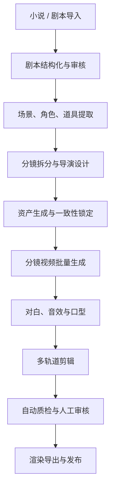
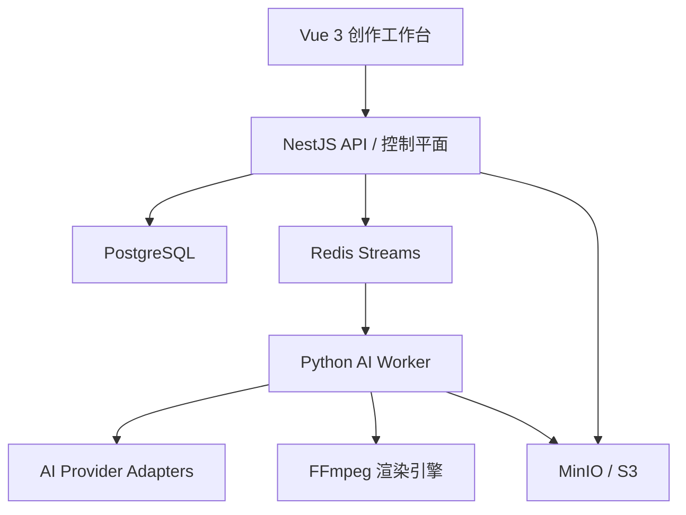
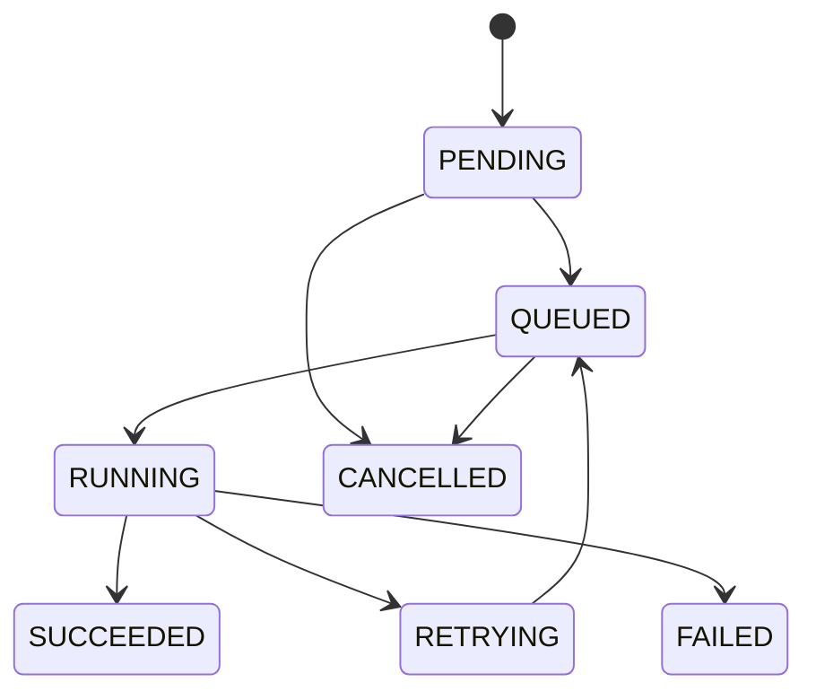

建议在你已经冻结的 V1 技术基线上继续扩展，不推翻原架构：

> Vue 3 创作工作台 + NestJS 控制平面 + PostgreSQL 事实源 + Redis Streams 工作流 + Python AI Worker + MinIO/S3 媒体中心 + FFmpeg 渲染引擎。

平台核心不是简单地“串联几个 AI 接口”，而是建立一套可版本化、可审核、可回退、可批量生产的内容生产系统。最终形成：

**IP 内容库 → 剧本工程 → 分镜工程 → 数字资产库 → 镜头生产线 → 音频生产线 → 多轨剪辑工程 → 渲染交付**

------

# 一、平台产品定位

平台面向三种生产模式：

| 模式        | 生产方式                         | 适合场景           |
| ----------- | -------------------------------- | ------------------ |
| 动态漫剧    | 角色立绘、场景图、分层动画、运镜 | 成本最低、批量连载 |
| AI 分镜视频 | 首帧/尾帧/参考图驱动视频模型     | 主流 AI 漫剧       |
| 全生成视频  | 文本或多模态直接生成完整镜头     | 高质量重点镜头     |

同一个项目可以混合使用三种方式。例如普通对话用动态漫剧，动作镜头用图生视频，关键高潮用高质量视频模型。

平台必须支持长篇、多季、多集 IP，因此内容层级扩展为：

```text
IP / Project
└── Season
    └── Episode
        ├── ScriptVersion
        ├── Scene
        ├── Shot
        └── Timeline
```

------

# 二、完整工业工作流



每一个阶段都必须具备：

- 自动生成
- 人工审核
- 局部重做
- 版本比较
- 上游变更影响分析
- 成本和耗时统计
- 失败重试与断点续作

不能设计成“一键生成后只能全部重来”。

------

# 三、总体系统架构



## 1. 前端创作工作台

沿用：

- Vue 3
- TypeScript
- Vite
- Pinia
- TanStack Query
- Naive UI
- Tiptap

新增几个关键引擎：

- WebCodecs：视频逐帧预览、代理素材播放
- Canvas/WebGL：时间线合成预览
- Web Audio API：波形、音轨混音预览
- 虚拟列表：管理数百个分镜和素材
- IndexedDB：缓存代理素材、草稿和撤销记录

浏览器只负责低分辨率预览，最终输出交给服务端 FFmpeg，避免不同电脑导出结果不一致。

## 2. NestJS 控制平面

NestJS 不执行重型 AI 和视频任务，负责：

- 用户、团队、权限
- 项目和剧集管理
- 数据版本管理
- 工作流编排
- 任务派发
- 审核流
- 成本核算
- AI Gateway 配置
- WebSocket/SSE 状态推送
- OpenAPI 接口
- 生成结果入库

继续采用模块化单体，不在初期拆微服务。

## 3. Python Worker

Python 3.12、asyncio，按照能力拆成不同 Worker：

| Worker          | 职责                                      |
| --------------- | ----------------------------------------- |
| `llm-worker`    | 小说解析、剧本改编、分镜拆分、Prompt 编译 |
| `image-worker`  | 角色、场景、道具、分镜参考图              |
| `video-worker`  | 文生视频、图生视频、首尾帧视频            |
| `audio-worker`  | TTS、音效、降噪、口型时间对齐             |
| `render-worker` | 代理视频、转码、合成、最终导出            |
| `qc-worker`     | 黑帧、画面跳变、人物一致性、音画同步检查  |

V1 可以共用一个代码库、用不同启动参数消费不同 Redis Stream。

------

# 四、第一阶段：小说/剧本导入

## 支持格式

- TXT
- Markdown
- DOCX
- EPUB
- PDF
- Fountain
- Final Draft XML
- 平台编辑器直接创建

## 导入后不能直接生成分镜

首先建立不可变的原始文档：

```text
SourceDocument
└── SourceDocumentVersion
```

保存：

- 原文
- 文件哈希
- 章节位置
- 段落位置
- 字符偏移量
- 导入时间
- 解析状态

后续生成的场景、台词、分镜都要能追溯到原文范围，从而满足你要求的：

- 严格按原文
- 不擅自修改剧情
- 不遗漏重要内容
- 可以检查 AI 增删了什么

## 小说理解流程

不要用一次大模型调用完成全书解析，应采用分层处理：

1. 文档清洗与章节切分
2. 分章提取实体和事件
3. 合并角色、地点、道具
4. 建立人物关系和时间线
5. 生成世界观圣经
6. 生成剧集规划
7. 改编成剧本
8. 人工确认后进入分镜

输出必须是结构化 JSON，而不是只有自然语言。

------

# 五、IP 圣经与一致性系统

这是整个平台最关键的部分。

## 1. 世界观圣经

保存：

- 世界规则
- 时间背景
- 地理结构
- 势力组织
- 能力体系
- 禁止冲突规则
- 专有名词
- 主线伏笔
- 季度故事线

以《现代茅山师》为例，可以锁定现实都市/异常世界双层结构、案件等级、能力成长路径、法器规则和六季主线。

## 2. 角色圣经

每个角色包含：

- 基础身份
- 年龄、身高、体型
- 五官和发型
- 服装套装
- 声音档案
- 性格和行为习惯
- 不同年龄阶段
- 不同剧情阶段造型
- 正面、侧面、背面设定图
- 表情集
- 动作集
- 角色参考图集合
- 模型专用身份参数

角色不能只有一个固定形象，需要增加：

```text
Character
└── CharacterAppearance
    ├── 默认造型
    ├── 第三集雨夜造型
    ├── 受伤状态
    └── 回忆中的少年状态
```

## 3. 场景圣经

保存：

- 空间布局
- 门窗位置
- 家具位置
- 光源方向
- 时间与天气版本
- 空镜参考图
- 摄影机可用区域
- 场景连续性规则

同一间客厅即使换角度，也必须共享同一个空间定义，避免门窗、沙发、人物方位随机变化。

## 4. 道具圣经

保存：

- 外观和尺寸
- 材质
- 使用方式
- 所属人物
- 剧情状态
- 损坏/变化版本
- 正反侧视图

------

# 六、剧本与分镜自动拆分

## 1. 分层结构

```text
Episode
└── Scene
    └── Beat
        └── Shot
```

- `Scene`：同一时间、地点下的戏剧场景
- `Beat`：一次叙事动作、信息揭示或情绪变化
- `Shot`：最终可生成的视频镜头

不能直接从章节跳到 Shot，否则剧情节奏和镜头衔接很难控制。

## 2. 分镜结构化字段

每个 Shot 至少包含：

```json
{
  "durationFrames": 96,
  "shotSize": "MEDIUM_CLOSE_UP",
  "cameraAngle": "EYE_LEVEL",
  "cameraMovement": "HANDHELD_SLOW_PUSH_IN",
  "characters": [],
  "characterActions": [],
  "dialogue": [],
  "sceneAssetId": "",
  "propAssetIds": [],
  "lighting": {},
  "composition": {},
  "continuity": {},
  "audio": {},
  "generationStrategy": "IMAGE_TO_VIDEO",
  "sourceReferences": []
}
```

针对你当前的 Seedance 工作流，项目模板可以默认锁定：

- 15 秒一段
- 4～6 镜
- 每镜最多一人说话
- 台词时长必须能够自然说完
- 伦勃朗光、逆光轮廓光、室内/森林丁达尔光
- 手持跟拍和自然轻微抖动
- 电影浅景深
- 真实眨眼、呼吸、发丝和衣褶运动
- 无字幕、无水印、无 UI
- 生成视频本身不带背景音乐
- 仅保留对白、环境音和动作音

这些配置属于项目级规则，但 Prompt 编译时必须展开进每个镜头，不能写“同上”。

## 3. 导演 Agent

导演模块负责：

- 判断哪些内容需要镜头表现
- 决定景别和机位
- 控制镜头节奏
- 安排人物视线
- 建立轴线
- 设置镜头衔接
- 避免连续多个构图重复
- 控制单镜动作复杂度

导演 Agent 只生成“导演设计”，不能直接覆盖已审核剧本。

------

# 七、Prompt 编译系统

不要直接把用户输入拼接成一段 Prompt，应建立编译器：

```text
项目视觉规则
+ 角色外观版本
+ 场景版本
+ 道具版本
+ 当前 Shot 数据
+ 前后镜头连续性
+ 模型能力模板
+ 负面提示词
= ProviderPrompt
```

同一个 Shot 可以编译成不同模型格式：

```text
ShotVersion
├── SeedancePrompt
├── KlingPrompt
├── VeoPrompt
├── ImagePrompt
└── TTSRequest
```

AI Gateway 统一接口：

```ts
interface VideoProvider {
  submit(request: VideoGenerationRequest): Promise<ProviderJob>;
  query(jobId: string): Promise<ProviderJobStatus>;
  cancel(jobId: string): Promise<void>;
  download(jobId: string): Promise<GeneratedMedia[]>;
  estimateCost(request: VideoGenerationRequest): Promise<CostEstimate>;
}
```

每个 Provider Adapter 负责处理：

- 参数映射
- 异步轮询
- Webhook
- 限流
- 重试
- 费用记录
- 文件下载
- 内容安全错误
- Provider 原始请求/响应归档

------

# 八、资产自动生成流程

资产不是一次生成一个结果，而是先出候选，再定稿。

```text
草案生成 → 候选对比 → 人工选定 → 一致性扩展 → 锁定版本
```

## 角色资产包

锁定角色后自动生成：

- 三视图
- 半身图
- 面部特写
- 表情九宫格
- 服装拆解
- 常用动作
- 不同光照
- 透明背景立绘
- 视频参考图
- 声音档案

## 场景资产包

- 纯场景空镜
- 正向、反向、侧向视角
- 全景空间布局
- 白天、夜晚、雨天等状态
- 景深层级
- 前景、中景、背景分层
- 可用于运镜的高分辨率图

## 资产状态

```text
DRAFT → GENERATING → CANDIDATE → APPROVED → LOCKED → DEPRECATED
```

只有 `APPROVED` 或 `LOCKED` 的资产才能进入批量镜头生产。

------

# 九、镜头视频生产线

## 两级生成策略

为了控制成本：

### 草稿模式

- 低分辨率
- 较短时长
- Fast 模型
- 可带显式水印标识“预览”
- 用于验证动作、机位和节奏

### 最终模式

- 使用已锁定角色和场景参考
- 高质量模型
- 完整时长
- 无平台水印
- 进入剪辑工程

## 镜头生成流程

1. 检查依赖资产是否锁定
2. 生成首帧/关键帧
3. 人工确认构图
4. 生成视频候选
5. 自动执行质量检测
6. 人工选择最佳候选
7. 必要时局部重生成
8. 转码为剪辑代理文件
9. 写入时间线素材库

## 局部重生成

重做时允许只修改：

- 人物动作
- 表情
- 运镜
- 光照
- 背景
- 时长
- Prompt 某一段
- 生成模型
- 随机种子

原版本不能被覆盖，要保留分支：

```text
Shot
└── ShotVersion 3
    ├── Generation A
    ├── Generation B
    └── Generation C（选定）
```

------

# 十、音频生产系统

音频应独立于视频生成，以便重新配音和剪辑。

## 音频资产类型

- 角色对白
- 旁白
- 环境声
- 动作音效
- 特殊效果音
- 可选音乐轨

针对你当前的项目模板，音乐轨默认关闭，不把背景音乐写进视频生成 Prompt。

## 声音一致性

每个角色拥有 `VoiceProfile`：

- 音色 Provider
- Voice ID
- 语速
- 音高
- 情绪范围
- 方言/口音
- 禁止变化项
- 示例音频

台词生成前先根据字数、标点和情绪估算时长。如果超过镜头时长，应提示修改镜头或拆分台词，不能简单加速朗读。

------

# 十一、多轨道剪辑系统

## 建议轨道结构

```text
V5  特效、粒子、遮罩
V4  前景、贴图、覆盖层
V3  人物层
V2  主视频/场景层
V1  底层背景

A5  特殊音效
A4  动作音效
A3  环境音
A2  旁白
A1  角色对白
```

字幕轨可以作为平台能力存在，但在你的无字幕项目模板中默认禁用。

## Timeline 数据模型

时间线以帧为统一单位，不使用浮点秒：

```json
{
  "timebase": 24,
  "durationFrames": 21600,
  "tracks": [
    {
      "type": "VIDEO",
      "clips": [
        {
          "assetVersionId": "asset_xxx",
          "timelineStart": 240,
          "sourceIn": 12,
          "sourceOut": 108,
          "transform": {},
          "effects": [],
          "keyframes": []
        }
      ]
    }
  ]
}
```

支持：

- 裁切
- 分割
- 拖动
- 吸附
- 转场
- 画面缩放
- 关键帧
- 调色
- 音量曲线
- 淡入淡出
- 波形显示
- 代理文件切换
- 撤销/重做
- 自动保存
- 时间线版本比较

## 最终渲染

时间线 JSON 是事实源，服务端将其编译为：

```text
Timeline JSON
→ Render Plan
→ FFmpeg filter graph
→ 分段渲染
→ 合并
→ 音频混合
→ 质量检测
→ 输出文件
```

采用分段渲染缓存。只修改第 12 个镜头时，不需要重新渲染整集。

------

# 十二、核心数据模型

在现有 Prisma Schema 上建议增加这些实体：

| 领域   | 核心实体                                                     |
| ------ | ------------------------------------------------------------ |
| IP     | Project、Season、Episode                                     |
| 原文   | SourceDocument、SourceDocumentVersion、SourceSegment         |
| 剧本   | Script、ScriptVersion、Scene、Beat、Dialogue                 |
| 分镜   | Shot、ShotVersion、ShotDependency、StoryboardPanel           |
| 资产   | Asset、AssetVersion、AssetCollection、AssetReference         |
| 角色   | Character、CharacterAppearance、VoiceProfile                 |
| 场景   | Location、LocationVersion、SceneContinuity                   |
| 生成   | Generation、GenerationCandidate、ProviderJob                 |
| 工作流 | Workflow、WorkflowRun、Task、TaskAttempt                     |
| 剪辑   | Timeline、TimelineVersion、Track、Clip、Transition、Keyframe |
| 审核   | Review、ReviewComment、Approval                              |
| 渲染   | RenderJob、RenderSegment、ExportPreset                       |
| 运营   | UsageRecord、CostRecord、AuditLog                            |

几个重要原则：

- 所有可生成内容都有版本。
- 数据库只保存元数据，对象文件进入 MinIO/S3。
- 已进入下游的版本不可直接修改，只能创建新版本。
- 每个 AI 结果必须保存模型、参数、Prompt、种子、参考图和费用。
- 时间线只引用 `AssetVersion`，不能引用随时变化的逻辑资产。

------

# 十三、任务协议与状态机

Redis Streams 负责派发，但 PostgreSQL 中的 Task 才是任务事实源。



任务必须包含：

```json
{
  "taskId": "task_xxx",
  "type": "VIDEO_GENERATE",
  "projectId": "project_xxx",
  "resourceType": "SHOT_VERSION",
  "resourceId": "shot_version_xxx",
  "inputVersion": 3,
  "idempotencyKey": "sha256...",
  "priority": 50,
  "attempt": 1,
  "maxAttempts": 3,
  "traceId": "trace_xxx"
}
```

必须解决：

- Worker 崩溃后的消息认领
- Provider 已提交但本地超时
- 重复消费
- 用户取消
- 批量任务部分失败
- 超过预算自动暂停
- 上游版本变化导致任务结果过期

------

# 十四、工作流编排

不要把整条流水线写死在代码里，应使用工作流定义：

```text
解析原文
  → 提取角色/场景/道具
  → 生成剧本
  → 剧本审核
  → 自动分镜
  → 分镜审核
  → 资产生成
  → 资产锁定
  → 镜头生成
  → 音频生成
  → 自动粗剪
  → 人工精剪
  → 导出审核
```

工作流节点分成：

- 自动节点
- 人工审核节点
- 条件分支
- 批量并行节点
- 聚合节点
- 失败补偿节点

V1 不需要引入复杂的第三方工作流平台，可以由 PostgreSQL 工作流实例 + Redis Streams 实现 DAG 调度。

------

# 十五、前端工作区设计

## 1. IP 中心

- 项目、季度、剧集树
- 世界观圣经
- 人物关系
- 故事时间线
- 全局视觉规则
- 术语库

## 2. 剧本工作区

左侧原文，中间剧本，右侧 AI 建议和差异检查：

```text
原文来源 | 当前剧本 | AI 修改 / 审核意见
```

支持点击剧本段落回溯原文章节。

## 3. 分镜工作区

- 卡片视图
- 表格视图
- 故事板视图
- 时间轴视图
- 前后镜头连续预览
- 批量修改风格和运镜
- 单镜 Prompt 编辑器

## 4. 资产中心

- 角色
- 服装
- 场景
- 道具
- 表情
- 声音
- 视频
- 音效

必须提供“被哪些剧集、场景和镜头使用”的反向引用。

## 5. 生成中心

- 任务队列
- 候选对比
- 参数对比
- 成本和预计完成时间
- 失败原因
- 批量重试
- Provider 状态

## 6. 剪辑工作台

整体布局建议：

```text
左侧：素材库
中间：播放器
右侧：属性与特效
底部：多轨时间线
顶部：版本、审核、导出
```

------

# 十六、自动质量检查

平台需要建立机器质检，而不能完全依靠人工观看。

## 画面质检

- 黑帧、白帧
- 帧冻结
- 编码损坏
- 分辨率和帧率异常
- 人物面部异常
- 多余肢体
- 角色服装漂移
- 场景布局突变
- 镜头轴线错误
- 水印/UI/意外字幕
- 闪烁和画面跳变

## 音频质检

- 爆音
- 静音
- 峰值削波
- 环境噪声
- 台词被截断
- 对白重叠
- 音画不同步
- 角色声线不一致

## 剧情质检

- 原文关键事件遗漏
- 台词归属错误
- 人物出现在错误场景
- 道具状态前后冲突
- 人物伤势、服装、时间连续性冲突

质检结果只能标记和拦截，不能未经允许自动覆盖人工定稿。

------

# 十七、成本控制

每次生成都记录：

- Provider
- 模型
- 输入/输出量
- 视频时长
- 生成次数
- 成功或失败
- 实际费用
- 预计费用
- 所属项目/剧集/镜头

支持三级预算：

```text
团队月预算
→ 项目预算
→ 单集预算
```

批量生成前先估算：

```text
镜头数 × 每镜候选数 × 单次价格 + 音频 + 渲染
```

预算超限时进入 `WAITING_BUDGET_APPROVAL`，而不是继续消耗。

------

# 十八、权限与审核

建议角色：

- Owner
- Producer
- Director
- Screenwriter
- Storyboard Artist
- Asset Artist
- Editor
- Reviewer
- Viewer

审核对象包括：

- 剧本版本
- 分镜版本
- 角色定稿
- 场景定稿
- 视频候选
- 时间线版本
- 最终成片

审核意见必须绑定具体版本和时间码，不能只是项目级留言。

------

# 十九、部署方案

V1 使用 Docker Compose：

```text
web
api
postgres
redis
minio
llm-worker
media-worker
render-worker
nginx
```

生产环境可以将 Worker 横向扩容，但暂时不引入：

- Kafka
- Kubernetes
- 独立微服务体系
- 独立向量数据库

PostgreSQL 可以先用 `pgvector` 保存角色、场景和剧情片段向量。真正遇到大规模检索瓶颈后再拆。

------

# 二十、推荐开发阶段

## Phase 1：可闭环 MVP

先完成一集从原文到成片：

- 小说/TXT 导入
- 章节和场景提取
- 剧本版本
- 自动分镜
- 角色/场景/道具资产
- 图像生成
- 视频生成
- Redis 任务系统
- 基础时间线
- FFmpeg 导出
- 成本记录

## Phase 2：工业化批量生产

- 多集批量拆分
- 角色一致性系统
- 首帧/尾帧工作流
- 候选对比
- 自动粗剪
- 音频系统
- 质量检测
- 审核流程
- 失败任务恢复

## Phase 3：专业创作平台

- 完整多轨编辑
- 关键帧和特效
- 团队协作
- 评论与审批
- 时间线分支
- 镜头依赖分析
- 多 Provider 智能路由
- 项目成本预测

## Phase 4：平台化与商业化

- 多租户
- 套餐和计费
- 模板市场
- 资产市场
- 工作流模板
- Provider 密钥托管
- API 开放平台
- 私有化部署

------

# 二十一、最重要的五项架构决定

1. **PostgreSQL 是唯一事实源，Redis 只做队列、锁、缓存和实时事件。**
2. **所有剧本、分镜、资产、Prompt、时间线都必须版本化。**
3. **时间线 JSON/EDL 是成片源文件，MP4 只是它的一次渲染结果。**
4. **项目规则、资产规则和镜头数据经过 Prompt Compiler 转换成各模型格式。**
5. **AI 自动化之间必须设置人工审核闸门，尤其是剧本、分镜、角色定稿和最终成片。**

这套方案保留了之前冻结的 V1 技术基础，同时补齐了真正决定平台能否工业化的四个核心：**资产一致性、版本追溯、任务编排和非线性剪辑**。下一阶段最适合直接进入 **Architecture Specification v1.1**，把新增的 `Season、Beat、AssetVersion、Timeline、Track、Clip、WorkflowRun、Review` 等模型落实为完整 Prisma Schema、NestJS 模块和 Redis Streams 协议。